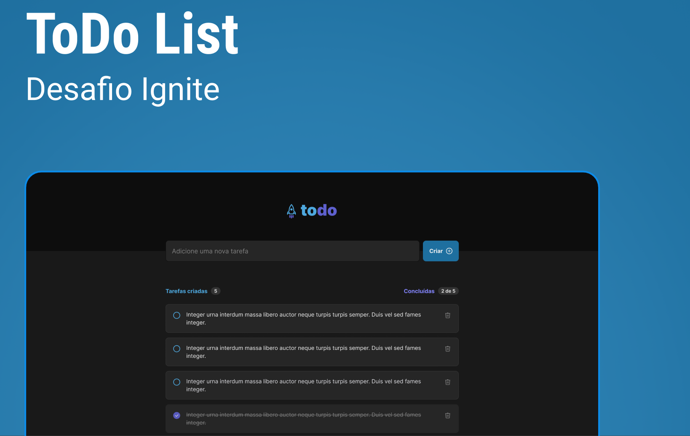
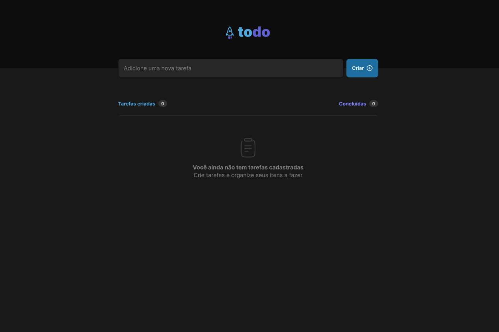

# Desafio 01 - Praticando os conceitos do ReactJS

<p align="center">
  

  
  
  <a href="https://github.com/GuilhermeProgrammer/desafio-ignite-reactjs-01/commits/master">
    
  </a>
    
   
   <a href="https://github.com/GuilhermeProgrammer/desafio-ignite-reactjs-01/stargazers">
    
  </a>

</p>

</p>
<h1 align="center">
    
</h1>

<h4 align="center"> 
	🚧  ToDo List - Concluído 🚀 🚧
</h4>

## Sobre o desafio

Nesse desafio, você vai desenvolver uma aplicação de controle de tarefas no estilo **to-do list**, que contém as seguintes funcionalidades:

- Adicionar uma nova tarefa
- Marcar e desmarcar uma tarefa como concluída
- Remover uma tarefa da listagem
- Mostrar o progresso de conclusão das tarefas

Apesar de serem poucas funcionalidades, você vai precisar relembrar conceitos como:

- Estados
- Imutabilidade do estado
- Listas e chaves no ReactJS
- Propriedades
- Componentização

<p align="center">
 <a href="#-sobre-o-projeto">Sobre</a> •
 <a href="#-layout">Layout</a> • 
 <a href="#-como-executar-o-projeto">Como executar</a> • 
 <a href="#-tecnologias">Tecnologias</a> • 
 <a href="#user-content--licença">Licença</a>
</p>


## 💻 Sobre o projeto

Nesse desafio, você vai desenvolver uma aplicação de controle de tarefas no estilo **to-do list**, que contém as seguintes funcionalidades:

- [x] Adicionar uma nova tarefa
- [x] Marcar e desmarcar uma tarefa como concluída
- [x] Remover uma tarefa da listagem
- [x] Mostrar o progresso de conclusão das tarefas

Apesar de serem poucas funcionalidades, você vai precisar relembrar conceitos como:

  - Estados
  - Imutabilidade do estado
  - Listas e chaves no ReactJS
  - Propriedades
  - Componentização

---

## 🎨 Layout

O layout da aplicação está disponível no Figma:

<a href="[https://www.figma.com/file/1SxgOMojOB2zYT0Mdk28lB/Ecoleta?node-id=136%3A546](https://www.figma.com/file/0n0zDN7zbzhRbaEO74Xesx/ToDo-List/duplicate)">
  
</a>

<h1 align="center">
    
    
</h1>
---

## 🚀 Como executar o projeto

Este projeto é feito apenas de frontend:

### Pré-requisitos

Antes de começar, você vai precisar ter instalado em sua máquina as seguintes ferramentas:
[Git](https://git-scm.com), [Node.js](https://nodejs.org/en/). 
Além disto é bom ter um editor para trabalhar com o código como [VSCode](https://code.visualstudio.com/)


#### 🧭 Rodando a aplicação web (Frontend)

```bash

# Clone este repositório
$ git clone git@github.com:GuilhermeProgrammer/desafio-ignite-reactjs-01.git

# Acesse a pasta do projeto no seu terminal/cmd
$ cd desafio-ignite-reactjs-01

# Instale as dependências
$ npm install

# Execute a aplicação em modo de desenvolvimento
$ npm run dev

# A aplicação será aberta na porta:5173 - acesse http://localhost:5173

```

---

## 🛠 Tecnologias

As seguintes ferramentas foram usadas na construção do projeto:

#### **Website**  ([React](https://reactjs.org/)  +  [TypeScript](https://www.typescriptlang.org/))

-   **[Phosphor Icons](https://phosphoricons.com/)**
-   **[Uuid](https://www.npmjs.com/package/uuid)**


> Veja o arquivo  [package.json](https://github.com/GuilhermeProgrammer/desafio-ignite-reactjs-01/blob/master/web/package.json)

---

## 💪 Como contribuir para o projeto

1. Faça um **fork** do projeto.
2. Crie uma nova branch com as suas alterações: `git checkout -b my-feature`
3. Salve as alterações e crie uma mensagem de commit contando o que você fez: `git commit -m "feature: My new feature"`
4. Envie as suas alterações: `git push origin my-feature`
> Caso tenha alguma dúvida confira este [guia de como contribuir no GitHub](./CONTRIBUTING.md)

---

## 📝 Licença

Este projeto esta sobe a licença [MIT](./LICENSE).

Feito com ❤️ por Guilherme Moraes